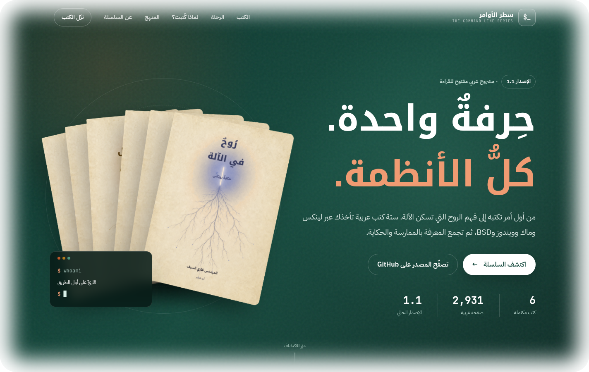

<div align="center">

<picture>
  
</picture>

# سلسلة سطر الأوامر · The Command Line Series

<a href="README.md">العربية</a> · <a href="README.en.md">English</a> ·
<a href="https://ghazi-ai.github.io/command-line-series/">الموقع</a>

<p>
  <a href="https://github.com/Ghazi-Ai/command-line-series/releases/latest"></a>
  <a href="LICENSES/README.md"></a>
  <a href="LICENSES/MIT.txt"></a>
  <a href="#كتب-السلسلة"></a>
</p>

**من الصفر إلى فهم الآلة**

**سلسلةٌ عربيّة تأخذك من الصِّفر المطلق إلى إتقان سطر الأوامر عبر الأنظمة كلّها.**

*One craft, every system — an Arabic-first series on the command line.*

المتطلّب الوحيد: أن تعرف القراءة والكتابة.

**ستّةُ كتبٍ — اكتملت كلُّها**

<br>

<a href="https://ghazi-ai.github.io/command-line-series/">
  
</a>

**[ادخل إلى الموقع، واستعرض الكتب في القارئ الإلكتروني](https://ghazi-ai.github.io/command-line-series/)**

</div>

---

<div dir="rtl" align="justify">

## 📚 كتب السلسلة

| # | الكتاب | الموضوع | الحالة |
|---|--------|---------|-------|
| 1 | 🟠 **مِن الصِّفر إلى الجَذر** | لِينُكس وسطر الأوامر | ✅ مكتمل — 48 فصلًا + 7 ملاحق · 628 ص |
| 2 | 🔵 **ماك من الطرفية** | macOS من الطرفية | ✅ مكتمل — 47 فصلًا + 5 ملاحق · 682 ص |
| 3 | 🟡 **مِن الصِّفر إلى المسؤول** | ويندوز: CMD وPowerShell وWSL | ✅ مكتمل — 42 فصلًا + 5 ملاحق · 671 ص |
| 4 | 🔴 **مِن الصِّفر إلى العِفريت** | FreeBSD وعالم BSD | ✅ مكتمل — 40 فصلًا + 5 ملاحق · 692 ص |
| 5 | 🟣 **الطرفيّةُ بالممارسة** | تمارين على الأنظمة الأربعة جنبًا إلى جنب | ✅ مكتمل — 9 أجزاء + ملحقان · 140 ص |
| 6 | 🔷 **رُوحٌ في الآلة** | حكاية يونِكس — كتابٌ أدبيّ للعامّة | ✅ مكتمل — 13 فصلًا · 114 ص |

> كلُّ كتابٍ يُبنى PDF كاملًا بغلافيه الأمامي والخلفي مدموجَين. المجموع 2,927 صفحة.

### أغلفة السلسلة

<div align="center" dir="rtl">
  <a href="https://github.com/Ghazi-Ai/command-line-series/releases/latest/download/1-linux-ar.pdf"></a>
  <a href="https://github.com/Ghazi-Ai/command-line-series/releases/latest/download/2-macos-ar.pdf"></a>
  <a href="https://github.com/Ghazi-Ai/command-line-series/releases/latest/download/3-windows-ar.pdf"></a>
  <a href="https://github.com/Ghazi-Ai/command-line-series/releases/latest/download/4-bsd-ar.pdf"></a>
  <a href="https://github.com/Ghazi-Ai/command-line-series/releases/latest/download/5-workbook-ar.pdf"></a>
  <a href="https://github.com/Ghazi-Ai/command-line-series/releases/latest/download/6-unix-story-ar.pdf"></a>
</div>

## ⬇️ التنزيلات · Downloads

الملفات النهائية منشورة كمرفقات في أحدث إصدار من GitHub. الروابط أدناه ثابتة،
وتشير دائمًا إلى آخر إصدار منشور.

| # | الكتاب | PDF | EPUB |
|---|--------|-----|-------|
| 1 | 🟠 **مِن الصِّفر إلى الجَذر** | [تحميل PDF](https://github.com/Ghazi-Ai/command-line-series/releases/latest/download/1-linux-ar.pdf) | `X` |
| 2 | 🔵 **ماك من الطرفية** | [تحميل PDF](https://github.com/Ghazi-Ai/command-line-series/releases/latest/download/2-macos-ar.pdf) | `X` |
| 3 | 🟡 **مِن الصِّفر إلى المسؤول** | [تحميل PDF](https://github.com/Ghazi-Ai/command-line-series/releases/latest/download/3-windows-ar.pdf) | `X` |
| 4 | 🔴 **مِن الصِّفر إلى العِفريت** | [تحميل PDF](https://github.com/Ghazi-Ai/command-line-series/releases/latest/download/4-bsd-ar.pdf) | `X` |
| 5 | 🟣 **الطرفيّةُ بالممارسة** | [تحميل PDF](https://github.com/Ghazi-Ai/command-line-series/releases/latest/download/5-workbook-ar.pdf) | `X` |
| 6 | 🔷 **رُوحٌ في الآلة** | [تحميل PDF](https://github.com/Ghazi-Ai/command-line-series/releases/latest/download/6-unix-story-ar.pdf) | [تحميل EPUB](https://github.com/Ghazi-Ai/command-line-series/releases/latest/download/6-unix-story-ar.epub) |

ملفات المتون للطباعة، بلا الغلافين:
[1](https://github.com/Ghazi-Ai/command-line-series/releases/latest/download/1-linux-ar-interior.pdf) ·
[2](https://github.com/Ghazi-Ai/command-line-series/releases/latest/download/2-macos-ar-interior.pdf) ·
[3](https://github.com/Ghazi-Ai/command-line-series/releases/latest/download/3-windows-ar-interior.pdf) ·
[4](https://github.com/Ghazi-Ai/command-line-series/releases/latest/download/4-bsd-ar-interior.pdf) ·
[5](https://github.com/Ghazi-Ai/command-line-series/releases/latest/download/5-workbook-ar-interior.pdf) ·
[6](https://github.com/Ghazi-Ai/command-line-series/releases/latest/download/6-unix-story-ar-interior.pdf).
راجع [دليل الطباعة](docs/PRINTING.md) قبل إرسال أي ملف إلى المطبعة.

> مصادر الإصدار الجاري إعدادها: **1.4**. ويبقى الإصدار 1.3 هو المعتمد
> والمنشور إلى أن تُستكمل فحوص 1.4 ويعتمده صاحب المشروع.

## 🎯 الفكرة

موضوعٌ واحد، أربع نوافذ (لِينُكس · ماك · ويندوز · BSD)، وقصّةٌ تجمعها. كلّ كتابٍ يبدأ من الصفر المطلق، ويبني بأسلوب **مفهوم ← جرّب بنفسك ← تحدٍّ**، ويجسِّر إلى شقيقاته. «العين تقرأ قبل العقل» — فالجمال أولويّة لا ترف.

## 🗂️ بنية المستودع

<div dir="ltr" align="left">

```
command-line-series/
├── books/            ← مصادر الكتب الستة وملفات Typst
│   ├── 1-linux/      ← «مِن الصِّفر إلى الجَذر»
│   ├── 2-macos/      ← «ماك من الطرفية»
│   ├── 3-windows/    ← «مِن الصِّفر إلى المسؤول»
│   ├── 4-bsd/        ← «مِن الصِّفر إلى العِفريت»
│   ├── 5-workbook/   ← «الطرفيّةُ بالممارسة»
│   └── 6-unix-story/ ← «رُوحٌ في الآلة»
├── docs/             ← الأدلة العامة وأصول README
│   ├── readme-brand/
│   └── readme-covers/
├── fonts/            ← الخطوط الحرة المستخدمة في البناء
├── lib/              ← القالب والمكونات ونظام التصميم المشترك
├── tools/            ← فحوص الإصدار ومولّد EPUB وأدوات الطباعة
├── site/             ← الموقع وقارئ الكتب
├── AUTHORS.md        ← المؤلفون والمساهمون
├── CHANGELOG.md      ← سجل التغييرات
├── CONTRIBUTING.md   ← دليل المساهمة
├── LICENSE           ← الرخصة
├── Makefile          ← أوامر البناء المحلية
├── PROJECT-STATUS.md ← حالة المشروع
├── build.sh          ← بناء الكتب الستة إلى مجلد build/
└── README.md         ← بوابة المشروع وروابط التنزيل
```

</div>

## 🛠️ البناء

يعتمد على Typst بالإصدار المحدد في `TYPST_VERSION`، والخطوطُ الحرّة
مثبَّتةٌ داخل `fonts/` (IBM Plex Sans Arabic، Noto Kufi Arabic،
JetBrains Mono) فيخرج البناءُ متسقًا في الخطوط والتصفيف وعدد الصفحات.

```bash
./build.sh              # يبني الكتب الستّة (PDF) إلى build/
./build.sh 1-linux      # يبني كتابًا بعينه
make release            # يبني PDF والمتون الستة وEPUB للكتاب السادس
make print-interiors    # يبني المتون الستة بلا الغلافين
make release-check      # يفحص مخرجات PDF والطباعة وEPUB
make check              # يفحص السكربتات وفروق Git
```

توليدُ EPUB (اختياريّ، للقراءة على الجوّال):

```bash
python3 tools/make_epub.py books/6-unix-story/ar build/6-unix-story-ar.epub
```

إعدادات الطباعة والغلاف الممتد موثقة في
[`docs/PRINTING.md`](docs/PRINTING.md)، وحدود الوصول في PDF موثقة في
[`docs/PDF-ACCESSIBILITY.md`](docs/PDF-ACCESSIBILITY.md). لا يخمّن
قالب الغلاف عرض الكعب؛ ويضع اسم الكتاب واسم «غازي السيف — أبو هيثم»
بعد تزويده بقيم المطبعة صراحةً.

## 🎨 الهويّة البصريّة

تصميمٌ داخليٌّ واحدٌ يجمع السلسلة (أخضرٌ صنوبريٌّ على ورقٍ دافئ)،
ولكلّ كتابٍ لونُ غلافه. استُخدمت أدوات توليد الصور في إعداد الفن
الأساسي للأغلفة، ثم نُسّقت العناصر النصية والتصميمية بأداة Typst.
وثّق صاحب المشروع أن الصور وُلّدت بالكامل عبر ChatGPT Images من
أوصاف نصية أصلية، دون مدخلات بصرية خارجية. وتبقى صور الأغلفة مستثناة
من عرض CC BY-SA 4.0، فلا تمنح رخصة المحتوى حق إعادة استخدامها تلقائيًا.

## 📜 الرخصة

المحتوى العام المحدد في [خريطة التراخيص](LICENSES/README.md) منشور
ابتداءً من الإصدار 1.3 برخصة **[CC BY-SA 4.0](LICENSE)**: يجوز
قراءته ونسخه وطباعته وبيعه وترجمته وتطويره، مع النسب وبيان التعديل
والمشاركة بالمثل. الشيفرة الأصلية المحددة في الخريطة تحت MIT، ومواد
الأطراف الثالثة تحت رخص أصحابها. لا تشمل الرخصة المواد غير المدرجة
في الخريطة ولا الأصول المستثناة.

نُشر الإصدار 1.2 سابقًا تحت CC BY-ND 4.0؛ ولا يسحب الإصدار 1.3
الحقوق التي منحتها النسخة السابقة بأثر رجعي.

## ✍️ الإعداد والإشراف والمراجعة

**صاحب الفكرة والمشروع، والإعداد والإشراف والمراجعة: المهندس غازي
السيف — أبو هيثم** · [Ghazi-Ai](https://github.com/Ghazi-Ai)

### الإفصاح عن استخدام الذكاء الاصطناعي

هذا المشروع من فكرة غازي السيف وتصميمه وإشرافه. جميع مسودات الكتب
ونصوصها الأساسية وُلّدت باستخدام أدوات الذكاء الاصطناعي. وتولّى غازي
وضع فكرة المشروع، وبناء هيكله، وتوجيه عملية الكتابة، وتنظيم مادته،
ومراجعتها وتدقيقها، واختيار ما يُعتمد منها، واعتماد النسخة المنشورة،
ويتحمّل مسؤولية القرارات التحريرية والمحتوى النهائي. لا تُنسب أدوات
الذكاء الاصطناعي بوصفها مؤلفًا أو مؤلفًا مشاركًا. تفاصيل الأدوات في
[`AUTHORS.md`](AUTHORS.md).

<div align="center">
<sub>صُنعت بشغف، وبأداة Typst · Made with passion, typeset with Typst</sub>
</div>

</div>
