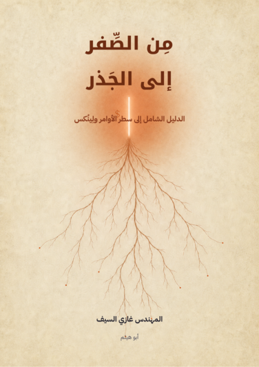
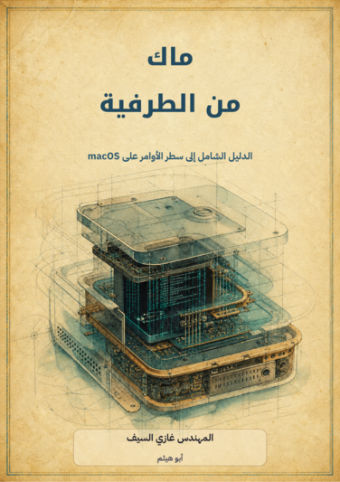
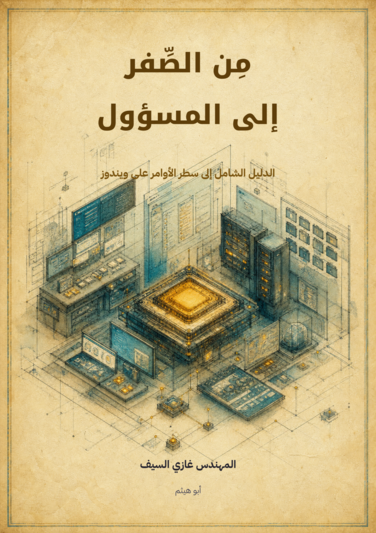
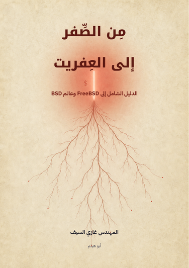
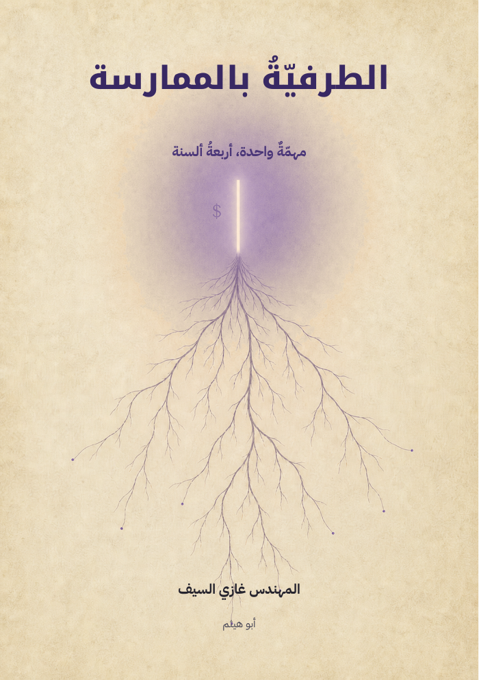
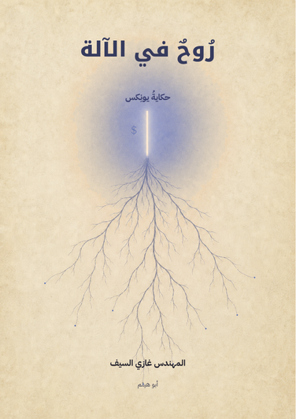

<div align="center">

# سلسلة سطر الأوامر · The Command Line Series

<a href="README.md">العربية</a> · <a href="README.en.md">English</a>

**سلسلةٌ عربيّة تأخذك من الصِّفر المطلق إلى إتقان سطر الأوامر عبر الأنظمة كلّها.**

*One craft, every system — an Arabic-first series on the command line.*

المتطلّب الوحيد: أن تعرف القراءة والكتابة.

**ستّةُ كتبٍ — اكتملت كلُّها**

</div>

---

<div dir="rtl" align="justify">

## 📚 كتب السلسلة

| # | الكتاب | الموضوع | الحالة |
|---|--------|---------|-------|
| 1 | 🟠 **مِن الصِّفر إلى الجَذر** | لِينُكس وسطر الأوامر | ✅ مكتمل — 48 فصلًا + 7 ملاحق · 601 ص |
| 2 | 🔵 **ماك من الطرفية** | macOS من الطرفية | ✅ مكتمل — 47 فصلًا + 5 ملاحق · 652 ص |
| 3 | 🟡 **مِن الصِّفر إلى المسؤول** | ويندوز: CMD وPowerShell وWSL | ✅ مكتمل — 42 فصلًا + 5 ملاحق · 650 ص |
| 4 | 🔴 **مِن الصِّفر إلى العِفريت** | FreeBSD وعالم BSD | ✅ مكتمل — 40 فصلًا + 5 ملاحق · 664 ص |
| 5 | 🟣 **الطرفيّةُ بالممارسة** | تمارين على الأنظمة الأربعة جنبًا إلى جنب | ✅ مكتمل — 9 أجزاء + ملحقان · 109 ص |
| 6 | 🔷 **رُوحٌ في الآلة** | حكاية يونِكس — كتابٌ أدبيّ للعامّة | ✅ مكتمل — 13 فصلًا · 117 ص |

> كلُّ كتابٍ يُبنى PDF كاملًا بغلافيه الأمامي والخلفي مدموجَين. المجموع نحو 2,793 صفحة.

### أغلفة السلسلة

<div align="center" dir="rtl">
  <a href="https://github.com/Ghazi-Ai/command-line-series/releases/latest/download/1-linux-ar.pdf"></a>
  <a href="https://github.com/Ghazi-Ai/command-line-series/releases/latest/download/2-macos-ar.pdf"></a>
  <a href="https://github.com/Ghazi-Ai/command-line-series/releases/latest/download/3-windows-ar.pdf"></a>
  <a href="https://github.com/Ghazi-Ai/command-line-series/releases/latest/download/4-bsd-ar.pdf"></a>
  <a href="https://github.com/Ghazi-Ai/command-line-series/releases/latest/download/5-workbook-ar.pdf"></a>
  <a href="https://github.com/Ghazi-Ai/command-line-series/releases/latest/download/6-unix-story-ar.pdf"></a>
</div>

## ⬇️ التنزيلات · Downloads

الملفات النهائية منشورة كمرفقات في أحدث إصدار من GitHub. الروابط أدناه ثابتة،
وتشير دائمًا إلى آخر إصدار منشور.

| # | الكتاب | PDF | EPUB |
|---|--------|-----|-------|
| 1 | 🟠 **مِن الصِّفر إلى الجَذر** | [تحميل PDF](https://github.com/Ghazi-Ai/command-line-series/releases/latest/download/1-linux-ar.pdf) | `X` |
| 2 | 🔵 **ماك من الطرفية** | [تحميل PDF](https://github.com/Ghazi-Ai/command-line-series/releases/latest/download/2-macos-ar.pdf) | `X` |
| 3 | 🟡 **مِن الصِّفر إلى المسؤول** | [تحميل PDF](https://github.com/Ghazi-Ai/command-line-series/releases/latest/download/3-windows-ar.pdf) | `X` |
| 4 | 🔴 **مِن الصِّفر إلى العِفريت** | [تحميل PDF](https://github.com/Ghazi-Ai/command-line-series/releases/latest/download/4-bsd-ar.pdf) | `X` |
| 5 | 🟣 **الطرفيّةُ بالممارسة** | [تحميل PDF](https://github.com/Ghazi-Ai/command-line-series/releases/latest/download/5-workbook-ar.pdf) | `X` |
| 6 | 🔷 **رُوحٌ في الآلة** | [تحميل PDF](https://github.com/Ghazi-Ai/command-line-series/releases/latest/download/6-unix-story-ar.pdf) | [تحميل EPUB](https://github.com/Ghazi-Ai/command-line-series/releases/latest/download/6-unix-story-ar.epub) |

> الإصدار الحالي: [`v1.0.0`](https://github.com/Ghazi-Ai/command-line-series/releases/tag/v1.0.0)

## 🎯 الفكرة

موضوعٌ واحد، أربع نوافذ (لِينُكس · ماك · ويندوز · BSD)، وقصّةٌ تجمعها. كلّ كتابٍ يبدأ من الصفر المطلق، ويبني بأسلوب **مفهوم ← جرّب بنفسك ← تحدٍّ**، ويجسِّر إلى شقيقاته. «العين تقرأ قبل العقل» — فالجمال أولويّة لا ترف.

## 🗂️ بنية المستودع

<div dir="ltr" align="left">

```
command-line-series/
├── books/            ← مصادر الكتب الستة وملفات Typst
│   ├── 1-linux/      ← «مِن الصِّفر إلى الجَذر»
│   ├── 2-macos/      ← «ماك من الطرفية»
│   ├── 3-windows/    ← «مِن الصِّفر إلى المسؤول»
│   ├── 4-bsd/        ← «مِن الصِّفر إلى العِفريت»
│   ├── 5-workbook/   ← «الطرفيّةُ بالممارسة»
│   └── 6-unix-story/ ← «رُوحٌ في الآلة»
├── covers/           ← أصول الأغلفة الأمامية والخلفية والمرجع البصري
│   ├── front/
│   ├── back/
│   └── reference/
├── docs/             ← الأدلة والمخططات ونسخ الأغلفة المصغرة لـREADME
│   └── readme-covers/
├── fonts/            ← الخطوط الحرة المستخدمة في البناء
├── lib/              ← القالب والمكونات ونظام التصميم المشترك
├── tools/            ← أدوات توليد EPUB والهيكل
├── AUTHORS.md        ← المؤلفون والمساهمون
├── CHANGELOG.md      ← سجل التغييرات
├── CONTRIBUTING.md   ← دليل المساهمة
├── LICENSE           ← الرخصة
├── Makefile          ← أوامر البناء المحلية
├── PROJECT-STATUS.md ← حالة المشروع
├── build.sh          ← بناء الكتب الستة إلى مجلد build/
└── README.md         ← بوابة المشروع وروابط التنزيل
```

</div>

## 🛠️ البناء

يعتمد على [Typst](https://typst.app)، والخطوطُ الحرّة مثبَّتةٌ داخل `fonts/` (IBM Plex Sans Arabic، Noto Kufi Arabic، JetBrains Mono) فيخرج البناءُ متطابقًا على أيّ جهاز.

```bash
./build.sh              # يبني الكتب الستّة (PDF) إلى build/
./build.sh 1-linux      # يبني كتابًا بعينه
```

توليدُ EPUB (اختياريّ، للقراءة على الجوّال):

```bash
python3 tools/make_epub.py books/1-linux/ar build/1-linux-ar.epub
```

## 🎨 الهويّة البصريّة

تصميمٌ داخليٌّ واحدٌ يجمع السلسلة (أخضرٌ صنوبريٌّ على ورقٍ دافئ)، ولكلّ كتابٍ لونُ غلافه. التفاصيل كلُّها — الألوان والخطوط وهندسة الصفحة وبرومبت توليد الأغلفة — في [`docs/دليل-الهوية-البصرية.md`](docs/دليل-الهوية-البصرية.md).

## 📜 الرخصة

منشورةٌ برخصة **[CC BY‑ND 4.0](LICENSE)** (النَّسْب — بلا اشتقاق): تُقرأ وتُشارك وتُعاد نشرًا كاملةً وحرفيًّا مع النَّسْب، ولا تُنشر معدّلةً إلا بإذن المؤلف.

## ✍️ المؤلف

**المهندس غازي السيف** (أبو هيثم) — `eng.ghazi@icloud.com`

### الإفصاح عن استخدام الذكاء الاصطناعي

هذا المشروع من تأليف وإشراف غازي. استُخدمت أدوات الذكاء الاصطناعي كمساعد
بحثي وتحريري في بعض مراحل العمل، بما يشمل المتابعة، والمراجعة، والتدقيق
اللغوي، واكتشاف التناقضات، واقتراح التحسينات. راجع المؤلف المخرجات واعتمدها
أو عدّلها، ويتحمل المسؤولية النهائية عن المحتوى ودقته وصياغته.

<div align="center">
<sub>صُنعت بشغف، وبأداة Typst · Made with passion, typeset with Typst</sub>
</div>

</div>
